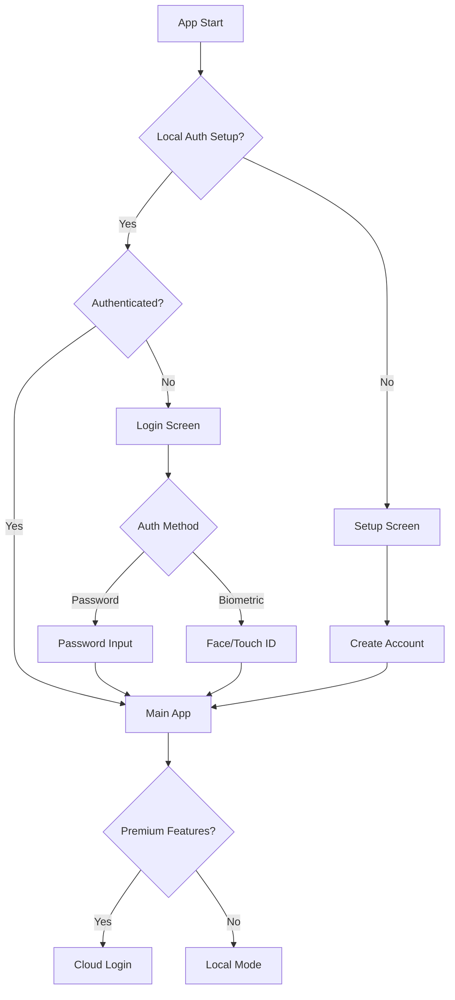

# 🛍️ Shop Manager - Local-First Business Management App

A React Native Expo app for small business owners to manage sales, inventory, expenses, and employees with a local-first approach and premium cloud features.

## ✨ Features

### Free Tier (Local-Only)
- ✅ Single shop management
- ✅ Sales tracking with receipt generation
- ✅ Inventory management with low-stock alerts
- ✅ Basic expense tracking
- ✅ Local authentication (password + biometrics)
- ✅ Basic reports and analytics (30 days)
- ✅ Data export (CSV/PDF)

### Premium Tier (Cloud-Enabled)
- 🚀 **Multi-shop support** - Manage multiple locations
- ☁️ **Cloud sync** - Access data across devices
- 📊 **Advanced analytics** - Detailed insights and trends
- 👥 **Team collaboration** - Employee management with permissions
- 🔄 **Automated backups** - Never lose your data
- 📈 **Advanced reporting** - Custom reports and forecasting
- 🔗 **Integrations** - Connect with accounting software
- 🎯 **Priority support** - Get help when you need it

## 🏗️ Architecture

### Tech Stack
- **Frontend**: React Native + Expo (SDK 50+)
- **Routing**: Expo Router (file-based routing)
- **Styling**: NativeWind (Tailwind CSS for React Native)
- **Database**: WatermelonDB (SQLite-based, reactive)
- **State Management**: Zustand + WatermelonDB observers
- **Authentication**: 
  - Local: Expo SecureStore + Biometrics
  - Cloud: Firebase/Supabase (for premium)
- **Payments**: RevenueCat/Stripe
- **Cloud Sync**: Custom sync engine with conflict resolution

### Local-First Design
```
📱 Device Storage (Primary)
├── 🗄️ SQLite Database (WatermelonDB)
├── 🔐 Encrypted Auth (SecureStore)
├── 📸 Local Images (FileSystem)
└── 📊 Offline Analytics

☁️ Cloud Storage (Premium Only)
├── 🔄 Real-time Sync
├── 👥 Multi-device Access
└── 📈 Advanced Analytics
```

## 🚀 Quick Start

### Option 1: Automated Setup (Recommended)
```bash
# Clone the repository
git clone <repository-url>
cd shop-manager

# Run the setup script
./setup.sh

# Start the development server
npx expo start
```

### Option 2: Manual Setup
```bash
# Prerequisites: Node.js 18+, Expo CLI
npm install -g @expo/cli

# Clone and install
git clone <repository-url>
cd shop-manager
npm install
npx expo install

# Start development
npx expo start
```

### Running the App
- **iOS**: Press `i` in terminal or scan QR with Expo Go
- **Android**: Press `a` in terminal or scan QR with Expo Go  
- **Web**: Press `w` in terminal or visit http://localhost:19006

📖 **Detailed setup instructions**: See [SETUP_GUIDE.md](SETUP_GUIDE.md)  
🚀 **Quick start summary**: See [QUICK_START.md](QUICK_START.md)

### First Run
1. **Setup Authentication**: Create your local account with password and optional biometrics
2. **Create Your Shop**: Add your shop details (name, currency, timezone)
3. **Add Products**: Start building your inventory
4. **Record Sales**: Begin tracking your business performance

## 📱 App Structure

```
src/
├── app/                    # Expo Router pages
│   ├── (authenticated)/    # Main app screens
│   ├── auth/              # Authentication screens
│   └── premium/           # Premium features
├── components/            # Reusable UI components
├── database/              # WatermelonDB models & schema
│   ├── models/           # Database models
│   └── schema/           # Database schema
├── services/             # Business logic & APIs
├── stores/               # Zustand state management
├── hooks/                # Custom React hooks
├── utils/                # Helper functions
├── types/                # TypeScript definitions
└── constants/            # App constants
```

## 🔐 Authentication Flow



## 💰 Premium Upgrade Flow

1. **Feature Discovery**: Users encounter premium-gated features
2. **Paywall Presentation**: Beautiful paywall with feature comparison
3. **Payment Processing**: Secure in-app purchases via RevenueCat
4. **Cloud Account Setup**: Email/password for cloud sync
5. **Data Migration**: Seamless migration from local to cloud

## 🗄️ Database Schema

### Core Tables
- **Users**: Local auth and profile information
- **Shops**: Multi-shop support for premium users
- **Products**: Inventory with categories and stock tracking
- **Sales**: Transaction records with line items
- **Expenses**: Business expenses by category
- **Employees**: Team management with permissions
- **Sync Queue**: Cloud synchronization tracking

### Sample Queries
```typescript
// Get low stock products
const lowStockProducts = await database.get<Product>('products')
  .query(
    Q.where('shop_id', currentShop.id),
    Q.where('stock', Q.lte, Q.column('min_stock'))
  )
  .fetch();

// Today's sales total
const todaySales = await database.get<Sale>('sales')
  .query(
    Q.where('shop_id', currentShop.id),
    Q.where('sale_date', Q.gte, startOfDay(new Date()).getTime())
  )
  .fetch();
```

## 🎨 UI Design System

### Color Palette
- **Primary**: Blue (#3B82F6) - Trust, reliability
- **Success**: Green (#22C55E) - Profits, positive actions
- **Warning**: Yellow (#F59E0B) - Alerts, attention needed
- **Error**: Red (#EF4444) - Losses, critical issues
- **Gray Scale**: Modern, clean interface

### Components
- **Cards**: Elevated surfaces for content grouping
- **Buttons**: Primary, secondary, and ghost variants
- **Forms**: Consistent input styling with validation
- **Charts**: Clean data visualization
- **Navigation**: Tab-based with contextual actions

## 📊 Analytics & KPIs

### Dashboard Metrics
- **Today's Performance**: Sales, expenses, profit
- **Trends**: 7-day charts for key metrics
- **Comparisons**: Yesterday, last week, last month
- **Alerts**: Low stock, high expenses, opportunities

### Advanced Analytics (Premium)
- **Profit Margins**: Product-level profitability
- **Customer Insights**: Purchase patterns and frequency
- **Inventory Turnover**: Stock movement analysis
- **Expense Breakdown**: Category-wise spending analysis
- **Forecasting**: Predictive analytics for planning

## 🔄 Cloud Sync Architecture

### Sync Strategy
1. **Optimistic Updates**: Local changes applied immediately
2. **Background Sync**: Automatic syncing when online
3. **Conflict Resolution**: Last-write-wins with user intervention option
4. **Incremental Sync**: Only changed records are synchronized
5. **Retry Logic**: Exponential backoff for failed operations

### Data Flow
```
Local Device ←→ Sync Queue ←→ Cloud API ←→ Database
```

## 🛡️ Security Features

### Local Security
- **Encrypted Storage**: All sensitive data encrypted at rest
- **Biometric Auth**: Device-level security integration
- **Auto-lock**: Configurable session timeouts
- **Data Validation**: Input sanitization and validation

### Cloud Security (Premium)
- **End-to-End Encryption**: Data encrypted before cloud storage
- **JWT Authentication**: Secure API access tokens
- **Role-Based Access**: Granular permission system
- **Audit Logs**: Track all data changes

## 🧪 Testing

### Test Coverage
- **Unit Tests**: Service layer and utilities
- **Integration Tests**: Database operations and sync
- **E2E Tests**: Critical user journeys
- **Performance Tests**: Database query optimization

### Running Tests
```bash
# Unit tests
npm test

# Watch mode
npm run test:watch

# Coverage report
npm run test:coverage
```

## 📱 Platform Support

### iOS
- **Minimum Version**: iOS 13.0+
- **Features**: Face ID, Touch ID, native navigation
- **App Store**: Optimized for App Store guidelines

### Android
- **Minimum SDK**: Android 6.0 (API 23)
- **Features**: Fingerprint, native navigation
- **Play Store**: Material Design compliance

## 🚀 Deployment

### Development
```bash
# Start development server
npx expo start

# Run on specific platform
npx expo start --ios
npx expo start --android
```

### Production
```bash
# Build for App Store/Play Store
eas build --platform all

# Submit to stores
eas submit --platform all
```

## 🤝 Contributing

1. Fork the repository
2. Create a feature branch (`git checkout -b feature/amazing-feature`)
3. Commit changes (`git commit -m 'Add amazing feature'`)
4. Push to branch (`git push origin feature/amazing-feature`)
5. Open a Pull Request

## 📄 License

This project is licensed under the MIT License - see the [LICENSE](LICENSE) file for details.

## 📞 Support & Documentation

### 📚 Guides
- **⚡ Quick Start**: [QUICK_START.md](QUICK_START.md) - Get running in 2 minutes
- **🚀 Setup Guide**: [SETUP_GUIDE.md](SETUP_GUIDE.md) - Detailed local development setup
- **🏗️ Architecture**: [ARCHITECTURE.md](ARCHITECTURE.md) - System design overview  
- **🔧 Implementation**: [IMPLEMENTATION_GUIDE.md](IMPLEMENTATION_GUIDE.md) - Development handbook
- **⚙️ Environment**: [.env.example](.env.example) - Configuration reference

### 🆘 Getting Help
- **Issues**: GitHub Issues for bugs and feature requests
- **Discussions**: GitHub Discussions for questions and ideas
- **Expo Docs**: [docs.expo.dev](https://docs.expo.dev)
- **WatermelonDB**: [watermelondb.dev](https://watermelondb.dev)

---

Built with ❤️ for small business owners who deserve better tools to manage their success.